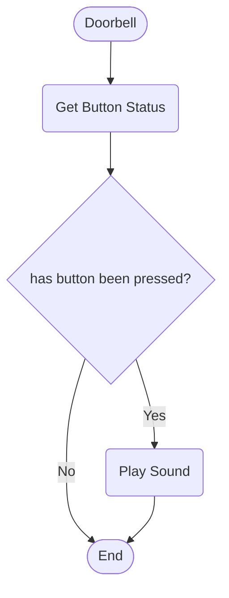
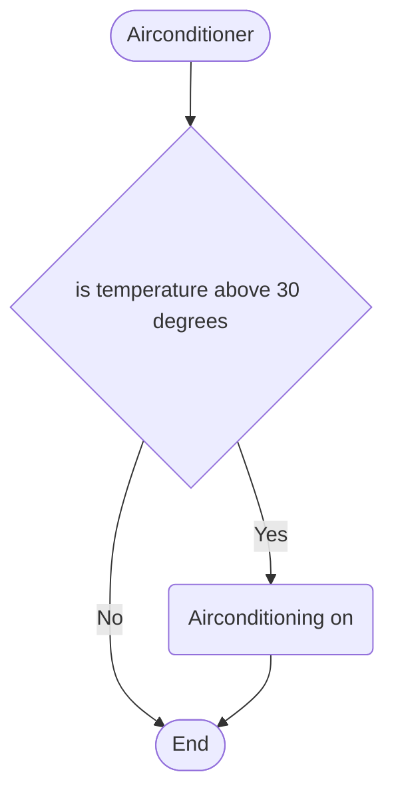
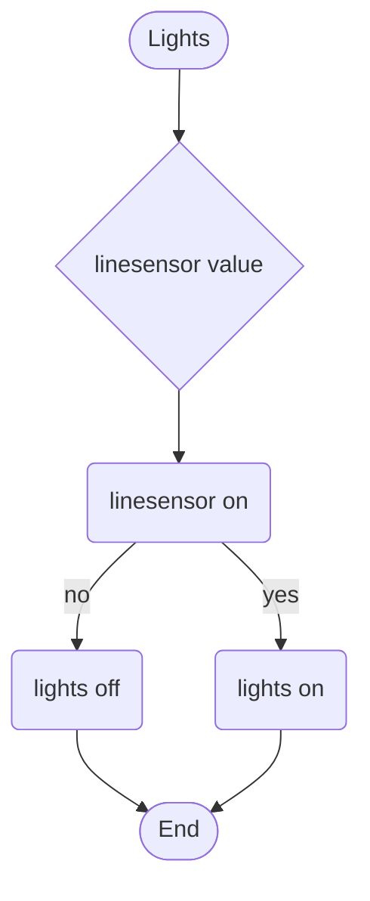
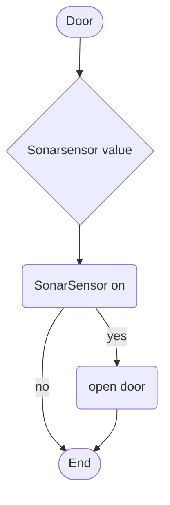

# Programming Logic
## Doorbell Logic

```mermaid
flowchart TD
    Start([Doorbell])
    getButtonStatus(Get Button Status)
    checkButton{has button been pressed?}
    soundDoorbell(Play Sound)
    finish([End])
   
   
   
    Start-->getButtonStatus-->checkButton
    checkButton-->|Yes| soundDoorbell
    checkButton-->|No| finish
    soundDoorbell-->finish

```

## Temperature Control Logic

```mermaid
flowchart TD
    Start([Airconditioner])
    checkTemp{is temperature above 30 degrees}
    AircondtionOn(Airconditioning on)
    finish([End])


Start-->checkTemp
    checkTemp-->|Yes| AircondtionOn
    checkTemp-->|No| finish
    AircondtionOn-->finish
```
## Light Control Logic

```mermaid
flowchart TD
Start([Lights])
LightsOff(lights off)
LightsOn(lights on)
lineOn(linesensor on)
LinesensorValue{linesensor value}
finish([End])


Start-->LinesensorValue-->lineOn
lineOn-->|yes| LightsOn
lineOn-->|no| LightsOff-->finish
LightsOn-->finish
```
## Door Control Logic

```mermaid
flowchart TD
Start([Door])
dcOn(open door)
SonarsensorValue{Sonarsensor value}
sonarOn(SonarSensor on)
finish([End])


Start-->SonarsensorValue-->sonarOn
sonarOn-->|yes| dcOn
sonarOn-->|no| finish
dcOn-->finish
```
